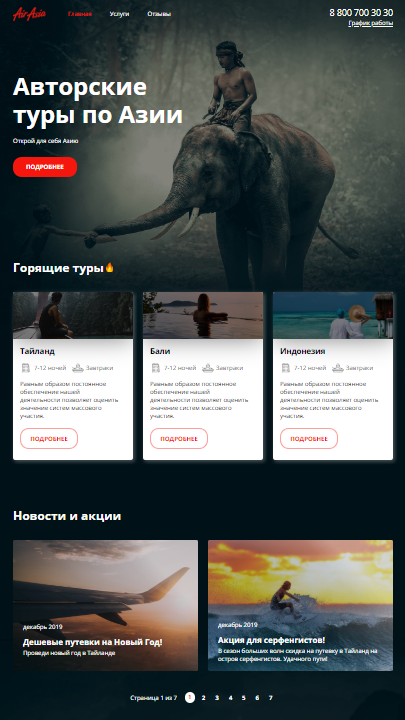

# air-asia

## Test adaptive multi-page website of tours to Asia.

The site was checked during an internship as an assistant mentor at LoftSchool

***Goal***: Deepen knowledge of **Pug** using various template engine features. Consolidate knowledge on working with **SCSS** и **BEM methodology**. Practice **adaptive** layout.

### Stack:
* The template engine **Pug** was used to write the markup code using mixin, loops, variables, template inheritance.
* The styles are written in the **SCSS** preprocessor. Variables, mixins, function, media queries on mixins are used.
* The site is built according to **BEM methodology**. Flex scheme - a block corresponds to a separate directory, elements and modifiers are implemented in the block files.

## Live Demo: [Air Asia](https://volkovva.github.io/loftschool/air-asia/)

## Project Installation

| Script | Destination |
| ------ | ----------- |
| yarn | Setting Dependencies |
| yarn run dev | Starting a server for project development |
| yarn run build | Build a project with optimization without running the server |