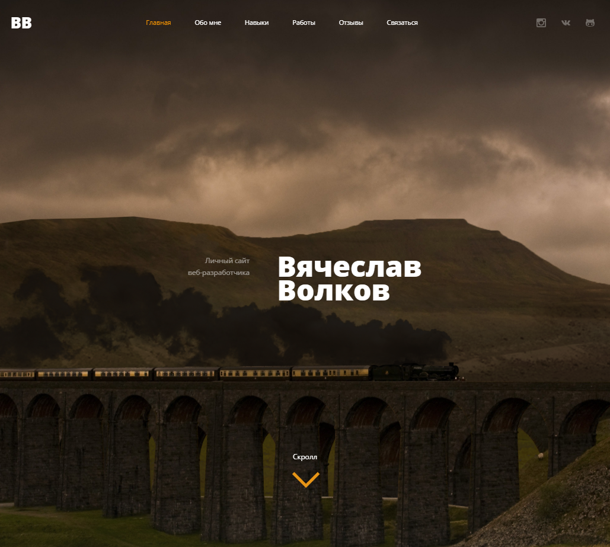
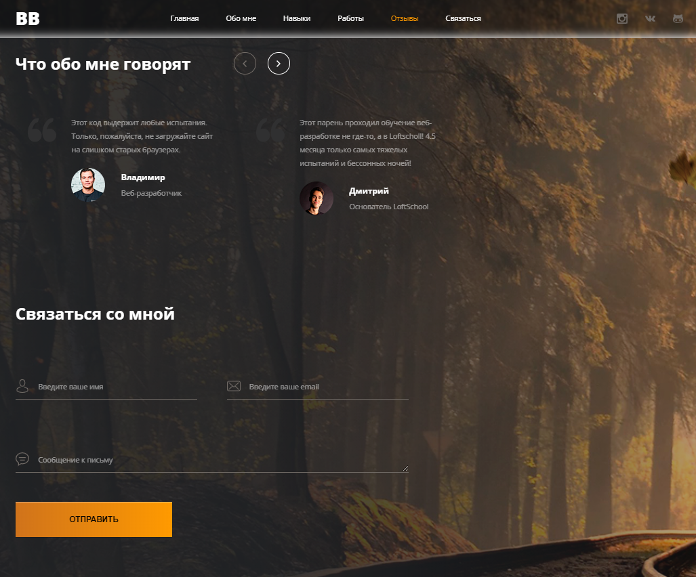
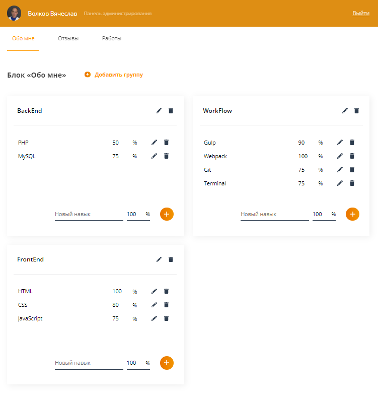
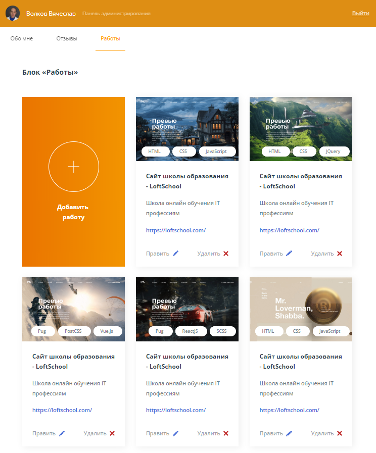

# portfolio

## Educational landing "Portfolio", theme "Autumn". Graduation project for the profession of "Web Developer".

The site was built in the third course of the "Vue.js". Advanced development by profession "Web developer" in LoftSchool.

***Goal***: Study **VUE.js**! In-depth study of the layout on the code template engine **Pug**, component-based approach to layout.
Basics of **Webpack**. Study **Grid**, code testing.

#### FrontEnd
* Pug
* PostCSS
* JavaScript
* Vue

#### Workflow
* Webpack
* Git
* Terminal
* NPM, Yarn

#### Code Vue.js
* Admin-panel
* Slider
* Vue Flickity slider

#### Code native JavaScript
* Parallax
* Smooth Scrolling
* Popup
* Preloader

#### Testing
* WebdriverIO
* Jest

### Login data for the admin panel
```
Login: test-admin
```
```
Password: 123456
```

## Live demo: [Portfolio](https://volkovva.github.io/loftschool/portfolio/)



## Live demo: [Admin Panel](https://volkovva.github.io/loftschool/portfolio/admin/#/login)



> Before installing the dependencies and running the project, make sure you have [last version Node.js & NPM](https://nodejs.org/en/download/current/) and
[last version Yarn](https://yarnpkg.com/ru/docs/install)

## Package.json scripts:

| Script | Destination |
| ------ | ------ |
| dev | Runs webpack-dev-server with **hot** module replacement |
| build | Will put together a project for **production** (the project is ready to be uploaded to the server) |
| reg | Console utility for registration. Use before you start working on **admin panel**. |

#### Run the script:
```sh
$ npm run name_script
```
##### Or:
```sh
$ yarn name_script
```